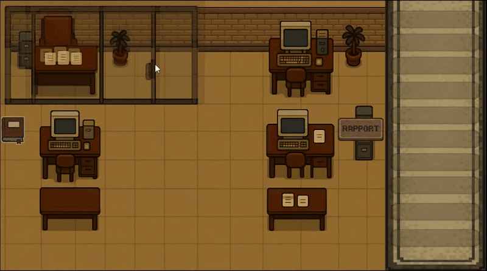

<link href="https://fonts.googleapis.com/css2?family=Roboto&display=swap" rel="stylesheet">

 
 

&nbsp;&nbsp;&nbsp;

# ☛ Notre équipe

L’équipe 🔥**Vos Gros Darons**🔥, composée de :

🔸 **Antoine CHAUMET** 

🔸 **Alexandre COUTON** 

🔸 **Amine BELHAJ** 

🔸 **Auguste DELAYE**

Vous présente leur cahier des charges du projet **T4**.

---

**Vos liens pour vos évaluations :** 

&nbsp;&nbsp;&nbsp;

&nbsp;&nbsp;&nbsp;

&nbsp;&nbsp;&nbsp;

&nbsp;&nbsp;&nbsp;

&nbsp;&nbsp;&nbsp;

&nbsp;&nbsp;&nbsp;

> Si vous avez du mal ou ne savez simplement pas comment tester notre prototype, vous pouvez retrouver [notre guide d'installation et d'execution.](Install.md)

# ☛ Présentation du projet

Ce projet a pour but de réaliser un **jeu sérieux** sur le métier **d'auditeur dans une université** afin d'aider des débutants dans ce domaine à leur donner **un avant-goût de la réalisation de leur premier audit**.

⚠️ **Attention** ⚠️ Il peut être intéressant pour vous de **bien comprendre le thème**. C'est pourquoi nous vous invitons à vous renseigner en lisant [**notre wiki**](Wiki.md).

 

# ☛ Audit of Legends

Un **jeu sérieux sur le métier d'auditeur en université** qui se focalise sur **la difficulté et les méthodes de récupération des informations auprès des audités**.

 

# ☛ Objectifs pédagogiques

Nous vous proposons 3 objectifs pédagogiques différents, à vous de choisir lequel / lesquels vous intéresse(nt) le plus.

 🔸 Compréhension du processus de réalisation de l'audit.

 🔸 Compréhension de la difficulté de la collecte d'informations.

 🔸 Compréhension de l'importance de la réalisation d'un audit.
 
 

## ✤ Objectifs pédagogiques avancés 

 

### Compréhension du processus de réalisation de l'audit

Il est important pour le joueur de comprendre quelles sont **les différentes étapes d'un audit**. Pour rappel, ces différentes informations se trouvent dans [le wiki](Wiki.md). Il est donc aussi important de bien faire comprendre au joueur **combien de temps est consacré à chaque section du processus** de réalisation d'un audit. Cet objectif ne se concentre donc **pas sur une partie** du processus, mais bien **sur son ensemble**.

Comme expliqué dans le wiki, le joueur doit bien passer par les trois grandes phases suivantes : **Préparation, réalisation et enfin communication**.

Le joueur devra donc apprendre à **gérer son temps efficacement** en fonction des priorités du processus d’audit. Il est important de **ne pas négliger la phase de préparation**, même si elle ne représente pas la partie la plus longue du temps global, car **une préparation insuffisante** risquerait de rendre la phase de réalisation **moins pertinente et moins efficace**.

Dans le cadre de ce processus, on souhaite que le joueur, après quelques parties, ait **compris l'importance de bien gérer ses ressources**, et ait déjà une idée de comment les organiser.

De plus, en apprenant à équilibrer les phases d’audit et à comprendre leur interdépendance, le joueur pourra **mieux saisir la complexité et l'importance de l’audit interne**.

 

### Compréhension de la difficulté de la collecte d'informations

L'objectif de cette partie du jeu est de faire comprendre au joueur **les défis de la collecte d'informations** dans un audit interne, en particulier lorsqu'il s'agit **d'interagir avec des employés**. Contrairement aux autres phases de l’audit, cette étape repose largement sur **les échanges humains** : le joueur doit apprendre à gérer des situations où l’information est **difficile à obtenir**, parfois **volontairement cachée ou non fiable**. Le joueur doit aussi comprendre que toutes les informations qu'il récolte ne sont **pas forcément exactes ou utiles**, ce qui complique d’autant la tâche d’audit.

La collecte d'informations est une étape clé de l’audit, car elle permet de comprendre le fonctionnement réel d’un processus et de détecter des anomalies ou des points d’amélioration. Cependant, elle comporte plusieurs défis liés à la nature humaine : 

  1. La **difficulté du dialogue** avec les employés (Méfiance et réticence, réticence à partager des informations sensibles, obstacles à la coopération)

  2. Les informations ne sont **pas toujours fiables** (Informations contradictoires, biais dans les témoignages, brouillard d'informations)

  3. Certaines informations ne sont **pas utiles** (Pertinence des données, sélection des sources d'information)

Dans ce contexte, le joueur devra interagir avec les employés, en particulier dans des **entretiens et des discussions informelles**.

Le jeu peut également contextualiser cette phase en montrant que l’audit ne se résume pas à la collecte d’informations brutes, mais qu’il s'agit également d’une phase de discernement. En parallèle, le joueur pourra voir **qu'une bonne collecte d’informations** permet de **mieux identifier les risques**, les anomalies ou les défaillances dans le processus audité. 

Malgré ce contexte, il faudra tout de même bien insister sur cette partie d'échanges si vous choisissez cet objectif.

Grâce à cet objectif, le joueur apprendra à **gérer la complexité** de cette phase et à **affiner ses compétences** en matière de **communication**, d’**analyse critique**, et de **prise de décision** dans un environnement complexe et parfois hostile.

 

### Compréhension de l'importance de la réalisation d'un audit

L'objectif de cet exercice est de faire comprendre au joueur **l'impact réel** d'un audit interne et **son importance** dans **l’amélioration des processus d’une organisation**. L'objectif se concentrera principalement sur **la rédaction du rapport d’audit** et **l'accompagnement dans les solutions proposées** pour résoudre les problèmes détectés. Le joueur devra saisir que l’audit **ne se limite pas à un simple état des lieux**, mais qu’il a **des conséquences directes** sur la gestion de l'organisation, en particulier dans l’identification de solutions concrètes pour améliorer les processus audités.

Un audit interne a pour vocation de détecter des anomalies et des dysfonctionnements au sein des processus, mais son véritable enjeu est de **proposer des solutions** qui permettent à l'organisation de **s'améliorer**. L’audit ne se limite pas à un simple rapport sur les failles existantes, mais doit aussi **viser l'amélioration continue et la résolution de problèmes**.

Avec cet objectif, le joueur n'est **pas forcément contraint à réaliser** un audit complet mais surtout à se concentrer sur **la rédaction / l'analyse d'un rapport final et des recommandations qui en découlent**.
Il devra par la suite utiliser ce rapport pour **amener plus facilement les solutions aux audités**.

Le joueur devra également comprendre que l’audit n'est **pas une fin en soi**, mais un **moyen d’apporter des solutions pratiques** pour améliorer les processus de l’organisation.

Pour mieux comprendre cet objectif, on peut imaginer le scénario suivant : 

1. **Rédaction interactive du rapport**

Le joueur sera invité à rédiger un rapport d’audit en choisissant parmi différentes options de recommandations. Le jeu pourrait fournir des feedbacks en fonction des choix du joueur pour lui indiquer si les recommandations sont adaptées, réalistes, et si elles résolvent réellement les problèmes identifiés.

2. **Scénarios de mise en œuvre des solutions**

Une fois les recommandations formulées, le joueur pourrait se retrouver dans des scénarios où il doit aider à la mise en œuvre de ces solutions. Il pourrait être confronté à des choix concernant le suivi des actions, l’accompagnement des équipes ou la mesure des résultats, ce qui lui permettrait de comprendre les défis pratiques liés à l’application des solutions proposées.

3. **Suivi et évaluation des résultats**

Des évaluations en temps réel permettent au joueur de voir l'impact de ses recommandations. Par exemple, des indicateurs de performance pourraient être présentés, montrant si les solutions ont amélioré les processus ou si des ajustements supplémentaires sont nécessaires.

À travers cet objectif, le joueur apprendra à **identifier des failles**, formuler des **recommandations pratiques**, et surtout à **suivre leur mise en œuvre** pour garantir que l’audit a bien **un impact positif** sur l’organisation.

 

# ☛ Description des fonctionnalités

🔴 IMPORTANT❗🔴 : Toutes les fonctionnalités qui sont décrites dans les parties suivantes n'ont pas forcément été implémentées dans le prototype. Le prototype a été conçu pour vous donner une idée d'une potentielle base de développement. À vous de l'améliorer ou de construire une nouvelle base au cours du T3. 

 

## ✤ Actions du joueur

Nous souhaiterions que le joueur puisse au moins : 

   🔸 Avoir le choix entre différents sujets d'audit

   🔸 Interagir avec les personnes auditées

   🔸 Interagir avec plusieurs personnes, qui possèdent des comportements différents à l'égard de l'auditeur

   🔸 Choisir avec qui il interagit lorsqu'il le souhaite

   🔸 Produire un rapport uniquement à partir des informations qu'il aura découvertes

 

## ✤ Logique de jeu

Dans la logique du jeu, il faudrait que :

   🔸 Les différentes interactions produisent des comportements différents

   🔸 Les informations reçues ne soient pas toutes vraies

   🔸 Une mécanique de vérification d'informations soit présente

   🔸 Le joueur ait un moyen d'être limité en termes d'actions / de temps pour représenter le temps qui passe, afin de bien faire comprendre au joueur qu'il n'a pas toute la vie pour faire un seul audit 

   🔸 Un système de confiance entre l'auditeur et les audités soit mis en place et que cette confiance influe sur les réponses de ces derniers 

 

## ✤ Interface

L'interface doit au moins pouvoir présenter :

   🔸 Un système d'interaction avec les audités

   🔸 Un affichage final qui indique si le joueur a fait du bon travail ou non

   🔸 Un moyen de connaître la confiance que lui accordent les audités (qu'il soit facilement visible ou non)

## ✤ Notre scénario

Afin de vous aider à plus facilement comprendre comment intégrer la plupart des fonctionnalités, nous vous proposons une version rédigée du déroulement du jeu dont nous avons réalisé le prototype.

Il est important de retenir que nous nous sommes concentrés sur **l'objectif pédagogique de la compréhension de la difficulté des échanges**.

**Étape 1** :

Le joueur vient de recevoir un mail de la direction qui lui indique qu’il doit commencer un nouvel audit.  
Ce mail fait comprendre au joueur qu'il est directement relié à la direction de l'établissement.

Un sujet d'audit est donné au joueur.

Une fois le sujet accepté, le joueur est informé qu'en tant qu'auditeur, il va passer à peu près 2 mois à se renseigner sur le domaine de l'audit.  
Dans notre cas, nous avons transmis de manière brève les points importants que le joueur doit connaître pour faire attention aux bonnes choses lors de ses interviews.

**Étape 2** :

Le joueur a la possibilité de rencontrer l'employé qu'il veut, quand il veut. Il a également la possibilité de rédiger un rapport lorsqu'il le souhaite.  
Lorsque le joueur rencontre un employé, il discute avec lui. Si l'employé connaît des informations sur le sujet et qu'il est assez confiant avec l'auditeur, il peut lui donner des informations.  
Plus le niveau de confiance est élevé, plus l'employé souhaiterait donner des informations.  
Plus le niveau de connaissance est élevé, plus l'employé sera en capacité de donner des informations.

Il y a différents profils d’employés qui sont plus ou moins collaboratifs. Le choix de l'ordre des interactions est important.

**Étape 3** : 

Lorsque le joueur le souhaite, il écrit le rapport, en fonction des informations qu’il a récupérées auprès des employés, et en fonction de la véracité des informations, le comité d'audit informera l'auditeur sur la satisfaction qu'ils ont vis-à-vis du rapport produit.

 

# ☛ Contraintes de développement

Au niveau de la contrainte de développement, le client vous laisse libre par rapport à la technologie utilisée, et sur quels points vous voulez appuyer votre jeu. 

En revanche, il est intéressant de garder en tête que le client souhaite ce jeu dans le but de donner une première approche à des débutants dans le domaine.  
Il faut donc penser à ne pas faire un jeu trop simplifié. C'est la raison pour laquelle nous avons détaillé au mieux le métier d'auditeur dans [le wiki](Wiki.md).

Une seule contrainte qui peut être intéressante à en déduire est qu'il peut être plus favorable de créer des scénarios générés aléatoirement, afin de permettre aux joueurs de réaliser plusieurs audits sur un même thème dans le but de les aider à mieux comprendre, plutôt que de les faire retenir quels choix sont les meilleurs dans un scénario donné. 

 

# ☛ Fonctionnalités supplémentaires optionnelles

Nous avons également pensé à d'autres ajouts qui pourraient vous intéresser : 

  🔸 Ajouter un système d'actions de tests sur certains scénarios (par exemple, engager une équipe de cybersécurité pour qu'elle fasse un test de faille dans le cas d'un audit)

  🔸 Si le système de tests est mis en place, ajouter un système de budget maximum pour limiter le nombre d'actions de tests que le joueur peut faire

  🔸 Ajouter un système de création de rapport plus poussé, où le joueur doit lui-même indiquer quelles informations il veut mettre dans quels blocs du rapport (par exemple, choix d'un groupe d'informations parmi plusieurs)

  🔸 Pour permettre un apprentissage plus direct et plus progressif, le joueur pourrait recevoir un feedback après chaque étape majeure du processus de réalisation de l'audit
    
  🔸 Le joueur pourrait également être confronté à des situations stressantes où des employés refusent de collaborer ou sont particulièrement méfiants. Il devra gérer la situation émotionnellement et apprendre à naviguer dans des dialogues difficiles.

  🔸 Ajouter une musique de fond et des bruitages sur l’interface utilisateur, par exemple un son lorsque le joueur survole un bouton ou effectue une action spécifique.
